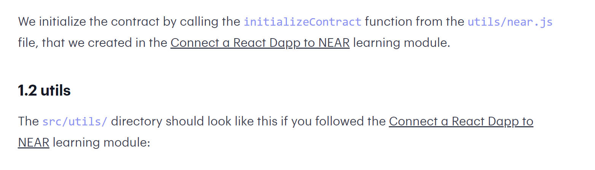

### `npm start`

Runs the app in the development mode.\
Open [http://localhost:3000](http://localhost:3000) to view it in your browser, connects to near blockchain.


### `Found some errors`


#### 1.1/1.2 Documentation link not working
- "Connect to a react dapp to near"

Near Tutorial [https://dacade.org/communities/near/courses/near-101/learning-modules/6f5115da-d439-4133-8b9b-dc66494fd6b2](https://dacade.org/communities/near/courses/near-101/learning-modules/6f5115da-d439-4133-8b9b-dc66494fd6b2)





#### Add buffer to window


Found this workaround online ([https://github.com/isaacs/core-util-is/issues/27](https://github.com/isaacs/core-util-is/issues/27)). Was receiving "Uncaught (in promise) ReferenceError: Buffer is not defined" error while running NPM start, connect wallet button not working.

Added the file config-overrides.js with the following code

```tsx
const webpack = require("webpack")

module.exports = function override(config, env) {
    //do stuff with the webpack config...
    config.resolve.fallback = {
        ...config.resolve.fallback,
        stream: require.resolve("stream-browserify"),
        buffer: require.resolve("buffer"),
    }
    config.resolve.extensions = [...config.resolve.extensions, ".ts", ".js"]
    config.plugins = [
        ...config.plugins,
        new webpack.ProvidePlugin({
            process: "process/browser",
            Buffer: ["buffer", "Buffer"],
        }),
    ]
    // console.log(config.resolve)
    // console.log(config.plugins)

    return config
}
```

Within components/utils/near.js 

- added line 4 “import * as buffer from 'buffer';”
- added line 15 “window.Buffer = buffer.Buffer;”

```tsx
import environment from "./config";
import { connect, Contract, keyStores, WalletConnection } from "near-api-js";
import { formatNearAmount } from "near-api-js/lib/utils/format";
import * as buffer from 'buffer';

const nearEnv = environment("testnet");

export async function initializeContract() {
    const near = await connect(
      Object.assign(
        { deps: { keyStore: new keyStores.BrowserLocalStorageKeyStore() } },
        nearEnv
      )
    );
    window.Buffer = buffer.Buffer;
    window.walletConnection = new WalletConnection(near);
    window.accountId = window.walletConnection.getAccountId();
    window.contract = new Contract(
      window.walletConnection.account(),
      nearEnv.contractName,
      {
        viewMethods: ["getProduct", "getProducts"],
        changeMethods: ["buyProduct", "setProduct"],
      }
    );
}

export async function accountBalance() {
  return formatNearAmount((await window.walletConnection.account().getAccountBalance()).total, 2);
}

export async function getAccountId() {
  return window.walletConnection.getAccountId();
}

export function login() {
  window.walletConnection.requestSignIn(nearEnv.contractName);
}

export function logout() {
  window.walletConnection.signOut();
  window.location.reload();
}
```

a


